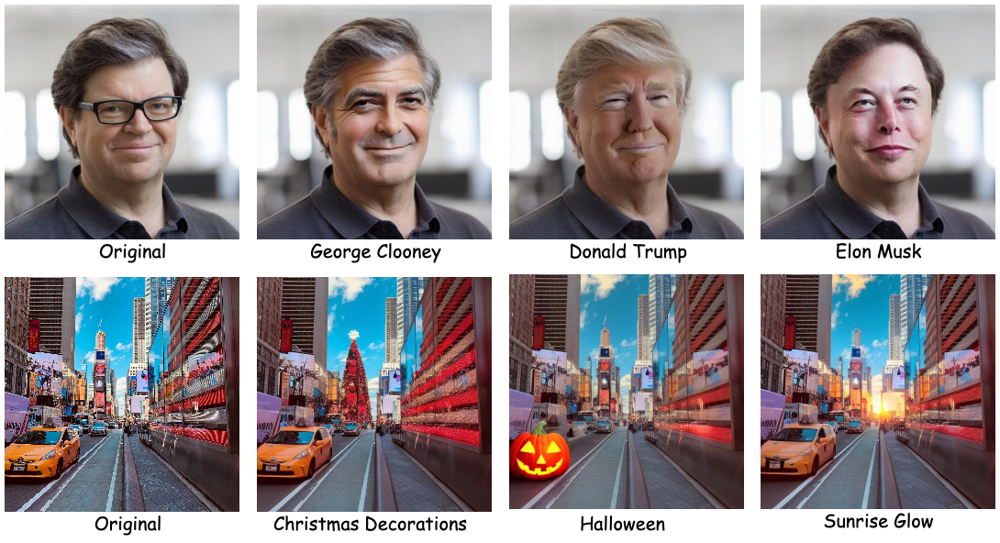
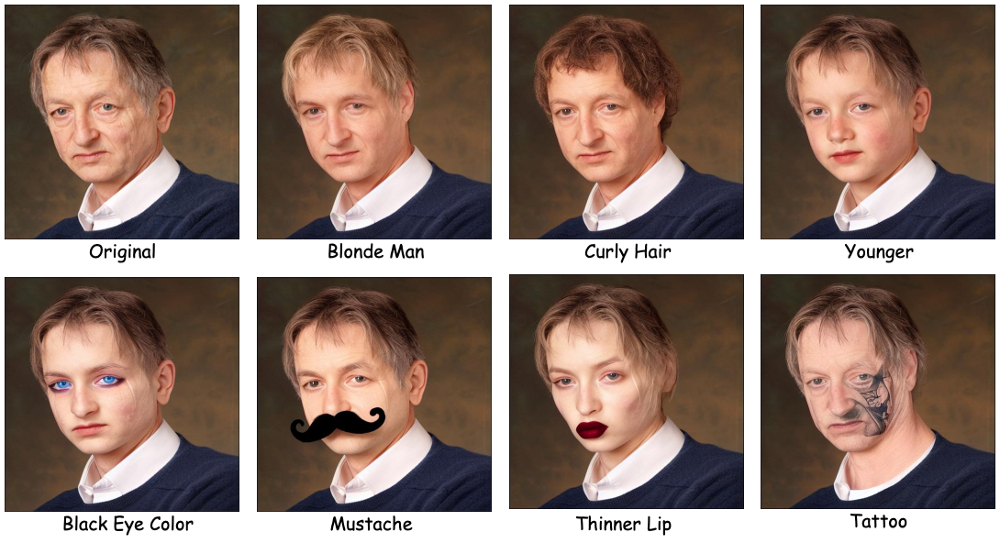
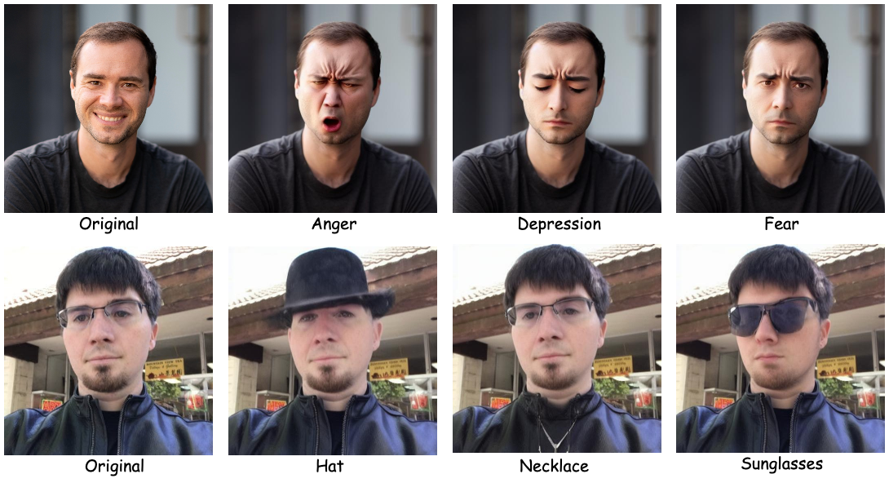
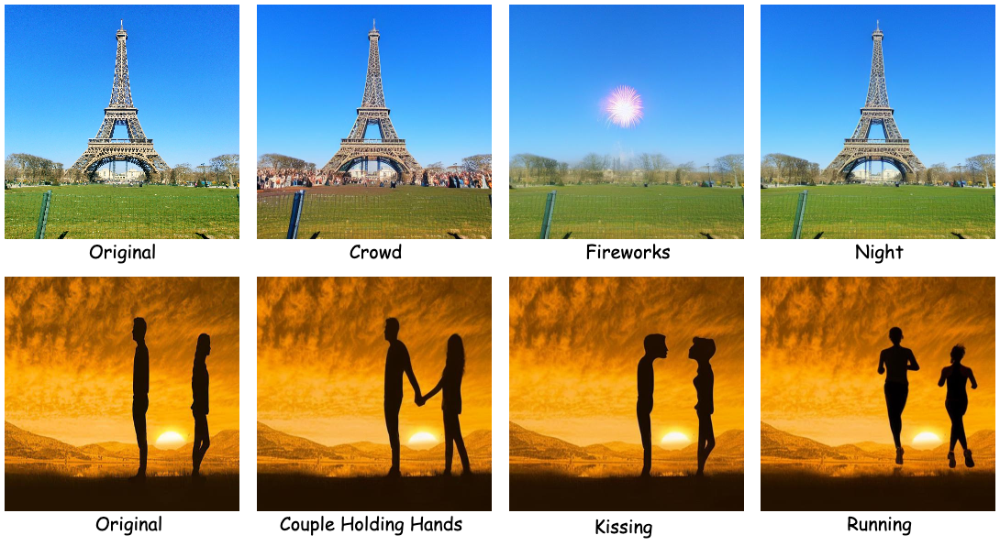
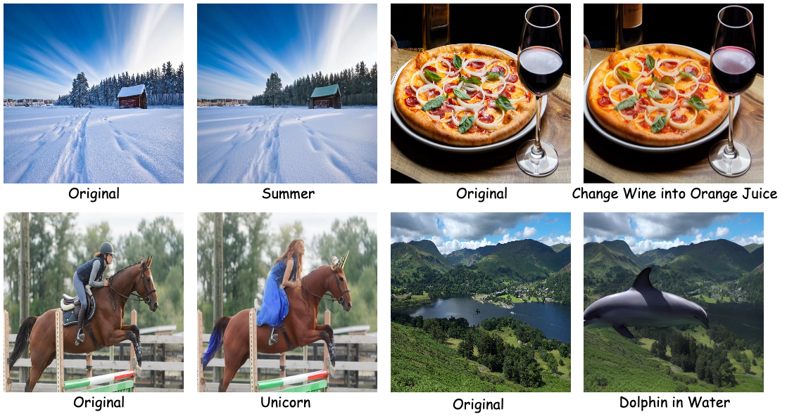

# 🎨 LEDITS++ in Action: Strengths and Limitations 

<p class="row" float="left" align="middle">

</p>

## 🧙🏻‍♀️ Overview
This repository enables users to test the [LEDITS++](https://leditsplusplus-project.static.hf.space/index.html) image editing model with custom images and prompts, analyzing results both qualitatively and quantitatively. **LEDITS++** is an efficient yet versatile and precise textual image manipulation technique. LEDITS++‘s novel inversion approach requires no tuning nor optimization and produces high-fidelity results with a few diffusion steps.

>**Important Notice:** This is a general and simplified implementation. Additional tuning options could enhance the model's outputs. The results demonstrated here may improve with more advanced configurations and adjustments.

## 🔎 Qualitative Results
In this section, I experimented with various editing aspects, including facial editing, scene editing, human emotions, wild nature, seasons, weather, themes, famous artist styles, etc. all of which can be observed in the ```prompts.json``` file. Don't forget to try your brilliant ideas!

Based on these experiments, the model demonstrates good performance when the image has a clear, **central object** that can be easily edited. It excels at typical edits that people commonly seek, such as modifying large-scale elements in the image. However, it struggles with more detailed changes, such as adjusting the color of someone's eyes. Additionally, the model faces challenges in understanding complex geometry, directions, and accurately recognizing objects within the image. These limitations suggest that the model's abilities are stronger in broad, high-level changes but weaker in fine-grained or precise adjustments. The following figures provide an overall qualitative assessment of how faithful the model’s outputs are to the provided prompts. They aim to depict both the strengths and weaknesses observed during the experiments.

<p class="row" float="left" align="middle">

</p>
<p class="row" float="left" align="middle">

</p>
<p class="row" float="left" align="middle">

</p>
<p class="row" float="left" align="middle">

</p>

## 📊 Quantitative Evaluation
For the quantitative evaluation, I used Frechet Inception Distance (FID) and CLIP Score.
- **FID:** This metric was calculated between all real images and their corresponding edited versions to evaluate how closely the edited images match the distribution of real images. A lower FID indicates that the generated edits are closer to the real images in terms of distribution, suggesting high realism and quality in the model’s outputs. The FID score for our experiments was 3.25.
- **CLIP Score:** CLIP Score was used to measure how well the generated images align with their respective prompts. This metric captures the semantic relevance of the edits by comparing image-text similarity. CLIP scores for each image are recorded in a text file located in the results folder of each image.

## 🏃🏻‍♂️‍➡️ Steps to Set Up and Run

Follow these instructions to set up your environment and execute the training pipeline.

### 1. Clone the Repository
```bash
git clone git@github.com:hossshakiba/image-editing.git
cd compositional-retrieval
```
### 2. Set Up the Environment
Using ```venv```:
```bash
python -m venv venv
source venv/bin/activate       # On macOS/Linux
venv\Scripts\activate          # On Windows
```
Using ```conda```:
```bash
conda create --name image-editing-env python=3.8 -y
conda activate image-editing-env
```
### 3. Install Dependencies
Install all required libraries from the ```requirements.txt``` file:
```bash
pip install -r requirements.txt
```
### 4. Edit the Images
```bash
python main.py --config ./config/config.yaml
```

## 🫶🏻 Acknowledgments

I would like to thank the authors of LEDITS++ for their significant contribution to the field of image editing and for making their code open-source. Their work has been a valuable resource in carrying out this study.
```bibtex
@inproceedings{brack2024ledits,
  year = {2024}, 
  booktitle = {Proceedings of the IEEE/CVF Conference on Computer Vision and Pattern Recognition (CVPR)}, 
  author = {Manuel Brack and Felix Friedrich and Katharina Kornmeier and Linoy Tsaban and Patrick Schramowski and Kristian Kersting and Apolinaros Passos}, 
  title = {LEDITS++: Limitless Image Editing using Text-to-Image Models}
}
```
